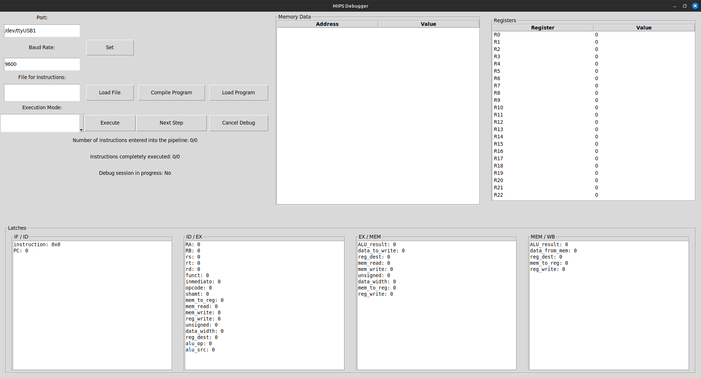

# Arquitectura de computadoras

En este trabajo final se lleva a cabo la implementación de un pipeline de 5 etapas para un procesador MIPS (Instruction Fetch, Instruction Decode, Execution, Memory Access y Write Back), incorporando mecanismos de detección y manejo de riesgos. El diseño se apoya en los conceptos teóricos que se ven durante el cursado, tiene como finalidad ejecutar un programa que utilice instrucciones y cuya ejecución se vea beneficiada por esto mismo. 
Además, se incluye una unidad de depuración para facilitar el proceso de verificación y corrección.

La implementación se realiza utilizando el lenguaje Verilog de descripción de hardware, junto con una placa basys 3 de Digilent compatible con Vivado, que se emplea tanto para simular como para programar.

## Tipos de Instrucciones en MIPS
El conjunto de instrucciones MIPS se divide en tres formatos principales, cada uno diseñado para representar diferentes tipos de operaciones dentro del procesador:

* Instrucciones Tipo R (Register)
Estas instrucciones operan únicamente sobre registros. Son utilizadas principalmente para operaciones aritméticas, lógicas y de desplazamiento entre registros.

<div align="center">
  
</div>

Ejemplo: `add $t0, $t1, $t2` Suma los registros `$t1` y `$t2` y guarda el resultado en `$t0`.

Aritmético y lógico: `ADDU`, `SUBU`, `AND`, `OR`, `XOR`, `NOR`, `SLT`, `SLTU`
  
Desplazamiento: `SLL`, `SRL`, `SRA`, `SLLV`, `SRLV`, `SRAV`

Salto registrado: `JR`, `JALR`

* Instrucciones Tipo I (Immediate)
Instrucciones que involucran una constante `inmediato` como operando. Se usan para operaciones aritméticas con inmediato, cargas y almacenamientos en memoria, y saltos condicionales.

<div align="center">
  
</div>

Ejemplo: `addi $t0, $t1, 10` Suma el contenido de `$t1` con el valor `inmediato 10` y almacena el resultado en `$t0`.

Aritmético y lógico con inmediato: `ADDI`, `ADDIU`, `ANDI`, `ORI`, `XORI`, `LUI`, `SLTI`, `SLTIU`
Acceso a memoria:  
  - Carga: `LB`, `LH`, `LW`, `LWU`, `LBU`, `LHU`  
  - Almacenamiento: `SB`, `SH`, `SW`
Salto condicional: `BEQ`, `BNE`

* Instrucciones Tipo J (Jump)
Estas instrucciones se utilizan para realizar saltos incondicionales a direcciones específicas del programa.

<div align="center">
  
</div>

Ejemplo: `j 0x00400000` Salta a la dirección de memoria `0x00400000`.

# Etapas

### Instruction Fetch

Esta etapa se encarga de obtener la próxima instrucción a ejecutar desde la memoria de instrucciones. Para ello, utiliza un **Program Counter (PC)** que se incrementa de a 4 bytes en cada ciclo de reloj, a menos que ocurra un salto o se active una señal de control que lo impida.

Está compuesto principalmente por dos subcomponentes:

- **Program Counter (`program_counter`)**:  
  Lleva la cuenta de la dirección de la próxima instrucción. Se reinicia con `reset`, se detiene si hay un `stall` o `halt`, y puede saltar a una dirección específica si se activa la señal `jump`.

- **Memoria de Instrucciones (`xilinx_one_port_ram_async`)**:  
  Es una memoria RAM de un solo puerto implementada como IP Core. Lee instrucciones de 32 bits (4 bytes) agrupando datos de 8 bits por posición. También permite escribir instrucciones si `i_write_instruction_flag` está activo.

Durante cada ciclo de reloj:

- Si no hay `stall` ni `halt`, se actualiza el PC y se busca la instrucción correspondiente.
- La instrucción leída se almacena en el latch `o_instruction`.
- Si `i_jump` está activo, el PC salta a `i_jump_address`.

Esto permite controlar el flujo de ejecución y soportar instrucciones de salto.

### Instruction Decode 

La etapa de *Instruction Decode* (ID) se encarga de interpretar la instrucción recibida desde *Instruction Fetch* y preparar toda la información necesaria para continuar su ejecución en el pipeline.

En primer lugar, se extraen y decodifican los distintos campos de la instrucción: `opcode`, `rs`, `rt`, `rd`, `shamt`, `funct` e `inmediato`. Esta información se usa tanto para acceder al banco de registros como para generar las señales de control para las siguientes etapas.

El banco de registros se accede en esta etapa: se leen los valores de los registros fuente (`rs` y `rt`) y también se gestiona la escritura desde *Write Back*. El contenido de los registros fuente se propaga hacia la etapa de ejecución.

Además, la lógica de control de esta etapa genera las señales necesarias para las etapas *EX*, *MEM* y *WB* del pipeline, en función del tipo de instrucción (R-type, I-type, saltos, loads/stores, etc.).

También se detectan instrucciones de salto (`beq`, `bne`, `j`, `jal`, `jr`, `jalr`) y se calcula la dirección a la que se debe saltar si corresponde. Esto incluye los saltos condicionales e incondicionales, tanto absolutos como basados en registros.

La etapa ID también se encarga de manejar los casos en los que el sistema debe detenerse temporalmente por un *stall* (espera por dependencia de datos) o un *halt* (pausa general). En esos casos, se inhiben las señales de control para evitar que la instrucción en curso avance de manera incorrecta.

Finalmente, se detecta la instrucción especial que indica el fin del programa (`0xFFFFFFFF`) y se lo informa a otras partes del sistema. También se incluye soporte para debugging, permitiendo inspeccionar el contenido de cualquier registro en tiempo real.

### Execution 

La etapa de *Execution* (EX) se encarga de realizar las operaciones aritméticas y lógicas indicadas por la instrucción, utilizando la ALU (Unidad Aritmético-Lógica). Esta etapa también resuelve la dirección de memoria para instrucciones de carga y almacenamiento, y determina cuál será el registro destino al que se escribirá más adelante.

El control de esta etapa permite seleccionar las entradas correctas para la ALU, en función de si se va a utilizar un valor inmediato o un segundo operando proveniente del banco de registros. También se decide cuál es el campo de la instrucción que indica el destino del resultado (`rt` o `rd`), según el tipo de instrucción.

Se implementa lógica de *forwarding* para evitar problemas de dependencia de datos: si una instrucción depende del resultado de otra que aún no ha terminado su ejecución, se reenvía directamente ese resultado desde etapas posteriores del pipeline. Esta lógica actúa sobre ambos operandos (`A` y `B`), eligiendo entre el valor leído del registro o el que proviene de *MEM* o *WB*.

La ALU realiza la operación indicada. El tipo de operación depende del tipo de instrucción: puede ser determinada por el campo `funct` (para instrucciones tipo R), por el `opcode` (tipo I), o fija (como en cargas y saltos). En instrucciones como `jal` o `jalr`, se consideran casos especiales para seleccionar correctamente los operandos.

Al finalizar, se almacena el resultado de la ALU y el valor que se desea escribir en memoria (en caso de una instrucción store). Estas salidas se propagan a la siguiente etapa (*Memory*), junto con las señales de control correspondientes, que siguen acompañando a la instrucción a lo largo del pipeline.

La etapa también respeta señales de control globales como `reset` y `halt`, permitiendo detener el avance del pipeline o reiniciar sus registros internos cuando sea necesario.

### Memory 

La etapa *Memory* (MEM) se encarga de acceder a la memoria de datos para realizar operaciones de carga (*load*) o almacenamiento (*store*), según lo indique la instrucción que se está ejecutando. También se encarga de propagar el resultado de la ALU, el registro destino y las señales de control hacia la etapa siguiente.

Cuando la instrucción es un `load`, se accede a la dirección calculada por la ALU y se lee el contenido correspondiente. La lectura puede ser de un byte, una half word (2 bytes) o una word (4 bytes), y puede ser interpretada como con signo o sin signo. Si la dirección está desalineada, se fuerza su alineación hacia abajo para mantener consistencia en el acceso a memoria. El valor leído se extiende correctamente a 32 bits, de forma signada o no signada, según la instrucción.

En el caso de una instrucción `store`, se escribe el dato proveniente de la etapa anterior (EX) en la dirección indicada por la ALU, considerando también el ancho del dato.

La memoria se implementa como una RAM de un solo puerto asíncrona, y su escritura está habilitada solo si la instrucción así lo indica y el sistema no está en estado de *halt*. También se incorpora lógica para que una unidad de depuración externa pueda acceder a la memoria sin interferir con el pipeline.

Finalmente, la etapa transmite hacia *Write Back* tanto los datos leídos como el resultado de la ALU y el número del registro destino, junto con las señales de control que determinarán si efectivamente se escribirá en el registro y desde qué fuente provendrá ese dato.

### Write Back 

La etapa *Write Back* (WB) es la última y se encarga de seleccionar el dato que será finalmente escrito en el banco de registros. Esta decisión se basa en una señal de control (`mem_to_reg`) que indica si el dato proviene de la memoria de datos (en el caso de instrucciones tipo `load`) o del resultado de la ALU (para instrucciones aritméticas y similares).

Esta lógica se ejecuta de forma combinacional y, si el sistema está en estado de *reset* o *halt*, se asegura de no escribir ningún dato al registro. El valor seleccionado es luego enviado de vuelta al banco de registros, cerrando el ciclo de ejecución de una instrucción.

## Debug Unit 
Permite controlar y observar la ejecución del procesador MIPS a través de UART, facilitando el debugging de programas cargados en la memoria de instrucciones. 

Soporta tres modos:
  - `load_mode` (`\0lom`): Carga instrucciones en la memoria de instrucciones.
  - `cont_mode` (`\0com`): Ejecuta el programa de forma continua.
  - `step_mode` (`\0stm`): Permite la ejecución paso a paso.

- **Comunicación UART**:
  - Recibe comandos desde UART mediante `i_data_ready` e `i_data`.
  - Envía información como registros, latches y contenido de memoria a través de `o_data_to_fifo` y `o_write_en_fifo`.


## Interfaces y FIFO para transmisión UART

### Interfaz RX|debug_unit

El módulo `interface_receive_deb_unit` es el encargado de construir datos de 32 bits a partir de 4 bytes recibidos por el receptor UART, luego este nuevo dato de 32 bits se le envía a la debug_unit.

### FIFO debug_unit|(interfaz FIFO|TX)

La debug_unit carga los datos a enviar por UART en una FIFO de datos de 32 bits.

### Interfaz FIFO|TX

El módulo `uart_buffer` toma palabras de 32 bits desde una FIFO y se las envía byte a byte al transmisor UART. Cuando detecta que la FIFO no está vacía, lee una palabra de 32 bits, la guarda en un registro, y la envía al transmisor en 4 etapas, cada una correspondiente a un byte. Luego vuelve a esperar más datos.

### Diagrama:


## Interfaz gráfica
La interfaz grafica implementada en Python permite interactuar con la debug unit del proyecto. A continuación se exponen las funcionalidades a modo de API para quien la desee usar si le sirviera para su proyecto.



### Botones

- **Set**: abre un serial port con el puerto y el baudrate indicados en los cuadros de texto.

- **Load File**: permite cargar un archivo de lineas de texto los cuales deberían contener las instrucciones para el MIPS en assembler.

- **Compile Program**: toma las instrucciones y las compila al formato binario correspondiente. Una aclaración en esta parte, es que para las instrucciones de tipo I que requieren un offset (e.g. loads, stores), por un error se las intenta compilar como las demas tipo I, por ejemplo, la forma correcta de escribir un store que cargue el valor del registro $0 en la posición 4 de memoria es la siguiente:

```assembly
sw $0, 4($0)
```

Pero para este compilador se debe escribir como:

```assembly
sw $0, $0, 4
```

Otro ejemplo con un load:

```assembly
lw $0, 8($0)
```

Se debe escribir como:

```assembly
lw $0, $0, 8
```

Queda como tarea a futuro corregir esto.

- **Load Program**: carga las instrucciones en la placa, para esto le envía por UART el comando `\0lom` seguido de las instrucciones compiladas, y al final envía automáticamente la instrucción `0xFFFFFFFF` para indicar el fin del programa, por lo que esta no se debe incluir en el archivo de instrucciones.

- **Execute**: ejecuta el programa segun el modo seleccionado en la casilla de la izquierda.
  - **Continue**: al darle a `Execute` le envía a la placa el comando `\0com` para indicarle que debe ejecutar todo el programa y luego espera a recibir los datos al final de la ejecución de este.
  - **Step**: al darle a `Execute` entra en el modo step y le envía a la placa el comando `\0stm`, en este momento la primera instucción ya se encuentra en la etapa IF.
  
- **Next Step**: le envía el comando `nxst` para indicarle que avance un ciclo en la ejecución y espera a recibir todos los datos correspondiente a la ejecución de este ciclo.

- **Cancel Debug**: le envía el comando `clst` a la placa con el objetivo de indicarle que debe cancelar la sesión actual de debugging.
